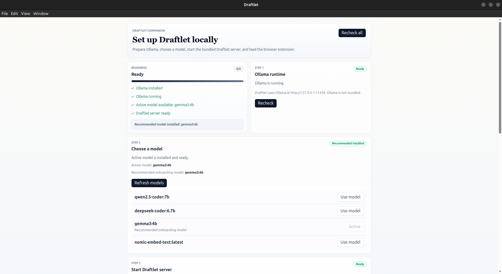
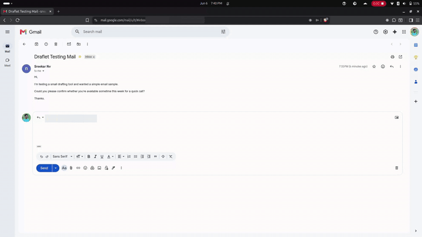

# Draftlet

Draftlet is a local-first browser drafting assistant. Select text on a webpage, generate reply drafts with a local Ollama model, then copy or best-effort insert a reply.

## Demo

### Desktop companion



Local runtime checklist for Ollama, model readiness, and the Draftlet server.

### Extension workflow



Selecting text, opening Draftlet, and generating local reply drafts.

## Why I Built It

Most AI writing tools send page context to hosted services. Draftlet explores the opposite shape: a browser UX backed by a local server, local model runtime, and local persistence so drafting help can stay on the user's machine.

## Product Shape

- **Browser extension:** selection detection, contextual launcher, reply workspace, history, copy, and best-effort insertion.
- **Electron desktop app:** setup companion for Ollama, model selection, and Draftlet server readiness.
- **Local FastAPI server:** prompt building, Ollama streaming, SSE responses, SQLite history, and preferences.

Ollama is required separately. Draftlet does not bundle Ollama. Packaged desktop builds can launch a bundled PyInstaller build of the Draftlet Python server.

## Key Engineering Highlights

- WXT Chrome extension with React isolated to the panel UI
- Shadow DOM in-page fallback plus Chrome side panel workspace where available
- Fetch-based SSE streaming from FastAPI to the extension UI
- Defensive delimiter parser for local model output
- Best-effort insertion for inputs, textareas, and basic contenteditable editors
- SQLite persistence with SQLAlchemy 2.0 and Alembic migrations
- Electron main/preload/renderer split with explicit IPC commands
- PyInstaller server bundle used by the desktop companion

## Main Features

- Generate three draft replies from selected webpage text
- Choose tone in the Draftlet panel
- Copy or insert a generated reply
- Fall back to clipboard when insertion is unsupported
- Revisit local generation history
- Select an installed Ollama model from the desktop app
- Check Ollama, model, and server readiness from one desktop flow

## Quick First Run

1. Open the Draftlet desktop app.
2. Install and start Ollama if needed.
3. Pull `gemma3:4b`, or select another installed Ollama model.
4. Start the Draftlet server from the desktop app.
5. Build and load the extension from `apps/extension/.output/chrome-mv3`.
6. Select text on a webpage and open Draftlet.

Detailed setup lives in [docs/setup.md](docs/setup.md).

## Local Development

```bash
pnpm install
cd apps/server && uv sync --group dev
cd ../..
pnpm dev
```

Useful commands:

```bash
pnpm dev:desktop
pnpm dev:extension
pnpm dev:server
pnpm build
pnpm make:desktop
```

## Tests

```bash
pnpm --dir apps/extension exec tsc --noEmit
pnpm --dir apps/extension test
pnpm --dir apps/extension build
pnpm --dir apps/desktop typecheck
cd apps/server && uv run pytest && uv run alembic upgrade head
```

CI runs these checks on push and pull request.

## Local URLs

- Draftlet server: `http://127.0.0.1:47632`
- Server health: `http://127.0.0.1:47632/health`
- Ollama: `http://127.0.0.1:11434`

## Privacy

Draftlet is local-first. Selected text is sent to the local Draftlet server, prompts are generated through local Ollama, and history/preferences are stored in local SQLite. There is no hosted Draftlet service in this repo.

## Current Limitations

- Insertion is best-effort and varies by website/editor.
- Ollama must be installed and running separately.
- The extension currently assumes the local server runs on `127.0.0.1:47632`.
- The browser extension is documented as an unpacked Chrome extension for repo-based testing.
- Local model output can still be malformed despite defensive parsing.

## More Docs

- [Setup and commands](docs/setup.md)
- [Architecture](docs/architecture.md)
- [Troubleshooting](docs/troubleshooting.md)
